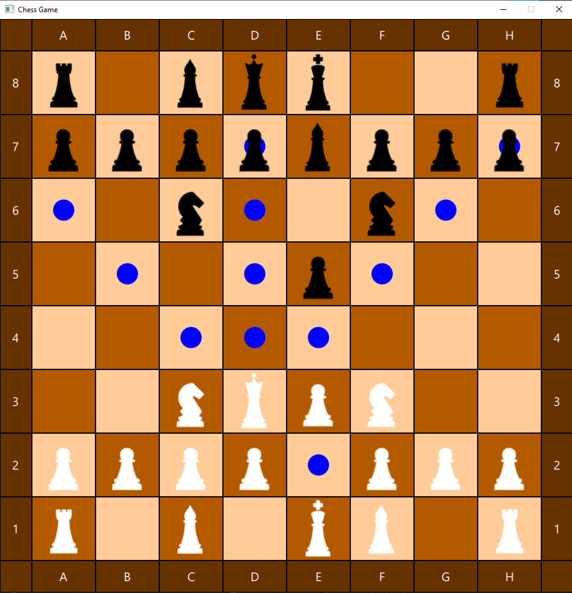

# Chess-Game
This is simple chess game written fully in C++ and QML.

# Design 

# Status
Currently I am working on adding castling and *en passant*

# Future Updates
There are planned several updates in the future:
* Customizable chess board and pieces with different colors
* Possibility to create player accounts on local machine
* Auto generating text file with moves made in game
